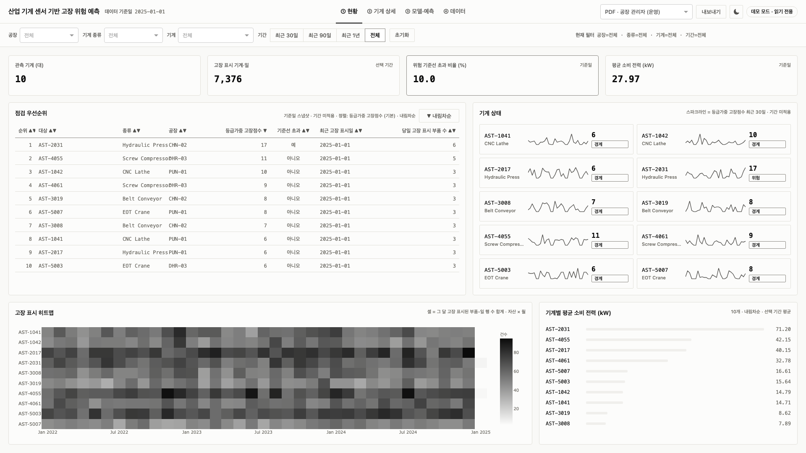
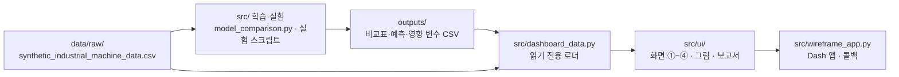

# 산업 기계 센서 기반 고장 위험 판별 대시보드

합성 산업 설비 데이터(기계 10대 × 부품 20종 × 1,095일)로 **기계별 고위험일을 당일 센서로 판별**하고, 단순 기준선(학습 구간 양성 비율, 기계별 과거 비율)과 같은 분할에서 비교해 보여 주는 Dash 대시보드입니다.



```bash
pip install -r requirements.txt          # Python 3.11
python -m src.wireframe_app              # DB·로그인 없이 실행
# → http://127.0.0.1:8052
```

로그인 없이 바로 4개 화면이 열립니다. 팀에서 만든 로그인·계정·MySQL 감사 로그 기능은 2026-10-03에 앱에서 떼어 [`archive/legacy/`](archive/legacy/README.md)에 보관했습니다. 다른 해상도·다크 테마 화면은 [`docs/images/`](docs/images/)에 있습니다.

## 1. 문제 정의와 과제 전환

- **처음 목표**는 부품 단위 사전 점검, 즉 "이 부품이 7일 안에 고장 표시될 확률"이었습니다.
- **같은 분할로 다시 비교하자 모델이 기준선과 거의 같았습니다.** 기계×부품별 과거 고장 비율만 쓰는 기준선 B가 로지스틱 회귀(LR)와 거의 같은 성능을 냅니다(출처 `outputs/pf_within_7d/comparison.csv`, 시험 28,514행).

  | 7일 내 고장 표시 | ROC-AUC | AP | 양성 비율 |
  |---|---|---|---|
  | 기준 B · 기계×부품별 과거 비율 | 0.619 | 0.611 | 0.506 |
  | 로지스틱 회귀 | 0.622 | 0.613 | 0.506 |

- **그래서 주 과제를 바꿨습니다.** 새 주 과제는 **기계 단위 당일 고위험일 판별**입니다.
  - 라벨: 기계·일마다 그날 고장 표시된 부품의 중요도를 A=4·B=2·C=1로 합한 고장점수가 기준(12·13·14) 이상이면 고위험일입니다.
  - 당일 센서를 입력으로 쓰므로 **사전 예측이 아니라 그날의 판별**입니다.

## 2. 결과 — 과제별 기준 A·B 대비

모든 수치는 시험 구간입니다.
- 기준 A: 학습 구간 양성 비율을 모든 행에 똑같이 주는 점수입니다.
- 기준 B: 학습 구간의 그룹별 과거 비율입니다.
- `src/model_comparison.py`가 같은 분할로 다시 계산합니다(`python -m src.model_comparison --task all`).
- **운영 모델**은 화면 ③이 보여 주는 모델입니다. 기계 고위험일 판별은 검증 구간 AP 1위 모델이고(2026-10-06 변경, 마감 제출본은 랜덤 포레스트), 부품 7일 내 과제는 팀이 정한 모델입니다.
- **검증 AP 최고**는 검증 구간 AP로 고른 모델입니다.

### 기계 고위험일 판별 (주 과제, 고장점수 ≥ 12)
출처 `outputs/machine_risk/comparison.csv`. 시험 2024-07-21~2025-01-01, 1,650 기계·일, 양성 비율 0.116.

| 모델 | AP | ROC-AUC | 정밀도 | 재현율 | 경보율 | 비고 |
|---|---|---|---|---|---|---|
| 기준 A · 학습 구간 양성 비율 | 0.116 | 0.500 | 0.116 | 1.000 | 1.000 | |
| 기준 B · 기계별 과거 비율 | 0.178 | 0.648 | 0.198 | 0.510 | 0.300 | |
| 로지스틱 회귀 | **0.298** | 0.759 | 0.257 | 0.552 | 0.250 | **운영 모델** · 검증 AP 최고 |
| 랜덤 포레스트 | 0.237 | 0.733 | 0.199 | 0.755 | 0.442 | 마감 제출본의 운영 모델(팀 결정) |
| HGB | 0.259 | 0.745 | 0.210 | 0.672 | 0.372 | |

정밀도·재현율·경보율은 검증 구간 F1 최대 컷오프 기준입니다. 기준 13·14의 결과도 같은 파일에 있습니다.

**불리한 점**
- 운영 모델(LR)도 경보 100건 중 실제 고위험일은 약 26건입니다.
- 정확도(0.762)는 "항상 정상"이라고 답하는 경우(0.884)보다 낮습니다.
- LR의 영향 변수 1위는 공장(`plant_code`), 3위는 기계 종류입니다(`outputs/machine_risk/feature_importance.csv`). 센서 신호만의 기여는 따로 나눠 보지 않았습니다.
- 마감 제출본은 RF를 운영 모델로 썼습니다. 같은 분할로 다시 비교하니 기준 12·13·14 모두 검증 AP 1위가 LR이어서 2026-10-06에 바꿨습니다([`docs/decision_log.md`](docs/decision_log.md)).

### 부품 7일 내 고장 표시 (보조 과제)
출처 `outputs/pf_within_7d/comparison.csv`. 시험 2024-07-21~2024-12-25, 28,514 기계·부품·일, 양성 비율 0.506. 원 실험이 검증 구간을 쓰지 않아 컷오프는 0.5로 고정했습니다.

| 모델 | AP | ROC-AUC | 정밀도 | 재현율 | 비고 |
|---|---|---|---|---|---|
| 기준 A | 0.506 | 0.500 | 0.506 | 1.000 | |
| 기준 B · 기계×부품별 과거 비율 | 0.611 | 0.619 | 0.583 | 0.614 | |
| 로지스틱 회귀 | 0.613 | 0.622 | 0.596 | 0.602 | |
| 랜덤 포레스트 | 0.562 | 0.568 | 0.550 | 0.618 | **운영 모델**(팀 결정) |

**불리한 점**
- LR은 기준 B보다 AP가 0.002 높을 뿐이고, 운영 모델 RF는 기준 B보다 낮습니다.
- 저장된 RF 예측은 같은 설정으로 다시 학습해도 재현되지 않습니다(점수 최대 차이 0.28, `comparison_config.json`의 `rf_reproduction_max_abs_diff`).

### 부품 당일 고장 표시 판별 (보조 과제)
출처 `outputs/current_state/comparison.csv`. 시험 2024-07-01~2025-01-01, 37,000 기계·부품·일, 양성 비율 0.100.

| 모델 | AP | ROC-AUC | 정밀도 | 재현율 | 경보율 | 정확도 |
|---|---|---|---|---|---|---|
| 기준 A | 0.100 | 0.500 | 0.100 | 1.000 | 1.000 | 0.100 |
| 기준 B · 기계×부품별 과거 비율 | 0.129 | 0.585 | 0.124 | 0.596 | 0.480 | 0.539 |
| HGB | 0.153 | 0.682 | 0.143 | 0.826 | 0.575 | 0.490 |

**불리한 점**
- HGB의 경보율이 57.5%입니다.
- 정확도(0.490)가 "항상 정상"(0.900)보다 낮습니다.
- 이 결과는 지금 코드로 재현되지 않고 커밋 `02d4489`에서 만들어졌습니다. 재현 명령은 `outputs/current_state/comparison_config.json`의 `reproduce`에 있습니다.

### 부품군 진단 (보조 과제)
부품군 9종별 당일 판별입니다(출처 `outputs/family_current/metrics.csv`, 시험 1,850 기계·일). 선택 모델의 AP는 0.211~0.501로, 같은 부품군의 양성 비율 0.140~0.332보다 높습니다. 부품군별 표는 [`docs/MODEL_CARD.md`](docs/MODEL_CARD.md)에 있습니다.

## 3. 구조와 스택



- 대시보드는 모델을 다시 학습하지 않고 `outputs/`와 원본 CSV를 읽기만 합니다.
- DB·로그인이 없습니다. 실행에 필요한 것은 원본 CSV와 `outputs/` 파일뿐입니다.

| 영역 | 패키지 (`requirements.txt`) |
|---|---|
| 데이터·모델 | pandas 2.2.3, numpy 1.26.4, scipy 1.13.1, scikit-learn 1.6.1, joblib 1.4.2 |
| 대시보드 | dash 2.18.2, plotly 5.24.1 |
| 보고서 내보내기 | reportlab 4.4.10(PDF), openpyxl 3.1.5(Excel) |
| 시계열 실험 | prophet 1.1.6, cmdstanpy 1.2.5, holidays 0.58 — `src/data_huijae.py`의 Prophet 실험에서만 쓰고 대시보드는 쓰지 않음 |
| 검증 | pytest 8.3.3, ruff 0.16.10·playwright 1.63.0(`requirements-dev.txt`) |

**화면**
- ① 현황: 고위험일 KPI, 점검 우선순위, 기계 상태, 고장 표시 히트맵(일·주·월·년), 전력
- ② 기계 상세: 센서 8종 종합 지표(센서별 정상 범위 경계와 경계 밖 날), 부품 출고 금액
- ③ 모델·예측: 과제별 모델·기준선 비교와 성능 해석 문장, 혼동행렬, 판정 임계값, 영향 변수, 부품군 진단의 운영 판단. 이 화면은 필터를 쓰지 않아 필터바를 숨깁니다.
- ④ 데이터: 조회 표, 품질 요약, 데이터 사전

모든 표는 열 제목을 누르면 오름차순 → 내림차순 → 기본 순서로 정렬되고, 기본 조회 기간은 최근 30일입니다.

디자인 규칙은 [`docs/DESIGN.md`](docs/DESIGN.md)에 있습니다. 색·글꼴은 `design/tokens.json` → `assets/00-tokens.css`와 `src/theme.py`(Plotly 템플릿)에서 옵니다.

**검증 명령**

```bash
pytest -q                                  # 274 passed (PDF 내보내기 테스트 1건은 한글 TrueType 글꼴이 필요)
ruff check .
python -m scripts.capture_screens          # 4화면 × 3해상도 캡처 + 금지 문구·가로 스크롤·잘린 셀 검사
python -m scripts.a11y_check               # axe-core 접근성 검사 → docs/a11y/
```

## 4. 한계

- **합성 데이터입니다.** 실제 설비 이력이 아니므로 수치는 방법 비교용이고 현장 성능이 아닙니다.
- **당일 판별은 사전 예측이 아닙니다.**
  - 주 과제는 그날 센서로 그날 고위험 여부를 판별합니다.
  - 고장을 미리 알려 주는 7일 내 과제는 기준 B를 넘지 못했습니다.
- **부품 교체 시점을 예측하지 않습니다.** 잔여 수명(RUL)이나 교체일은 다루지 않습니다.
- **고장점수 가중치와 기준이 실험값입니다.** 가중치(A=4·B=2·C=1)와 기준(12·13·14)은 실험적으로 정했고, 현장의 중대 고장 기준으로 확정하지 않았습니다(`src/huijae_example.py`의 결과 해석 문구).
- **화면 ①의 등급 경계는 실험적으로 정한 값입니다.** 정상 0 · 주의 1~5 · 경계 6~11 · 위험 12 이상이며, 현장 중대 고장 기준으로 검증된 경계는 아닙니다.
- **화면 ③ "운영 판단"의 판정 규칙은 대시보드가 정한 기준입니다.**
  - AP ÷ 실제 고장률 1.2배 미만이면 사용 불가입니다.
  - 경고 100건당 실제 고장이 50건 이상이면 점검 보조, 80건 이상이면서 탐지도 80건 이상이면 운영 검토입니다.
  - 나머지는 탐색적 사용입니다.
  - 현장 검증을 거친 기준이 아닙니다. 기계 10대 × 부품군 9종 90개 중 탐색적 83 · 사용 불가 4 · 점검 보조 3입니다.
- **결과 일부가 재현되지 않습니다.**
  - 부품 당일 과제는 지금 코드로 재현되지 않습니다.
  - 7일 내 과제의 RF 예측은 다시 학습하면 달라집니다.
  - 주 과제의 RF는 실행 환경에 따라 점수가 달라집니다. 같은 패키지 버전으로 Linux에서 다시 돌리면 AP가 최대 0.003, 예측 점수가 최대 0.06 달라집니다. LR·HGB·기준선은 같은 값이 나옵니다(LR은 기준 14에서 AP 차이 0.00001).

## 5. 팀과 기여

팀 프로젝트이며, 아래는 git 커밋 작성자 이름과 커밋 제목에서 보이는 작업 영역입니다(병합 커밋 제외, 동일인이 쓴 여러 커밋 계정은 한 줄로 합침).

| 작성자 | 커밋 수 | 커밋에서 보이는 작업 |
|---|---|---|
| 김영식 | 68 | 저장소 초기 설정, 대시보드 화면·데이터 로더 연동, 데이터 출처 기록, 데이터 검증, 디자인 시스템 파일, 포트폴리오 보완(디자인 시스템·모델 비교 재구성·접근성·정리) |
| 고도현 | 49 | 기계 고장점수·등급 모델, 이상 심각도 비교, 부품군 당일 진단, 확률형 기계 위험 실험, 현재 상태 분류·시계열 7일 위험 모델, EDA |
| 김희재 | 22 | 고장점수(A=4·B=2·C=1) 로지스틱 비교, 설비·부품 정답 후보 24가지 비교, 로그인·역할 계정·MySQL 감사 로그(현재 `archive/legacy/`) |

AI 도구: 대시보드 보완 커밋 일부는 Claude와 함께 작성했습니다(커밋의 `Co-Authored-By` 줄).

## 6. 데이터 출처·라이선스

- 데이터: Kaggle "[Machine Demand & Failure Prediction Dataset](https://www.kaggle.com/datasets/sdeogade/sparse-industrial-machine-time-series-dataset)"(합성 데이터), **CC BY-SA 4.0**
- 원본은 `data/raw/synthetic_industrial_machine_data.csv`(219,000행 × 22열)입니다.
- 접근일 등 자세한 내용은 [`DATA_SOURCES.md`](DATA_SOURCES.md)에 있습니다.
- 코드는 MIT([`LICENSE`](LICENSE))입니다. MIT는 데이터에 적용되지 않습니다.

## 문서

- [`report/final_report.md`](report/final_report.md) — 최종 보고서
- [`docs/MODEL_CARD.md`](docs/MODEL_CARD.md) — 과제·라벨·분할·기준선·지표·한계·금지 용도
- [`docs/decision_log.md`](docs/decision_log.md) — 의사결정 기록
- [`docs/troubleshooting_log.md`](docs/troubleshooting_log.md) — 트러블슈팅 기록
- [`docs/DESIGN.md`](docs/DESIGN.md) — 디자인 시스템 규칙
- [`docs/a11y/summary.md`](docs/a11y/summary.md) — 접근성 검사 결과
- [`docs/dashboard-improvement-plan.txt`](docs/dashboard-improvement-plan.txt) — 화면 구성 전면 개선안(조사 결과와 단계별 계획, 이 저장소에서는 미실행)
- [`archive/legacy/README.md`](archive/legacy/README.md) — 지금은 쓰지 않는 이전 단계 파일
